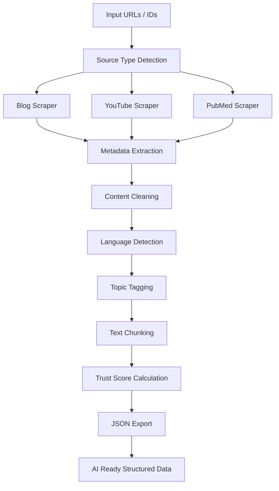
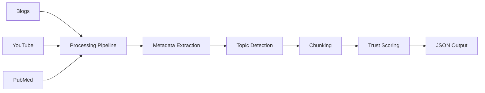
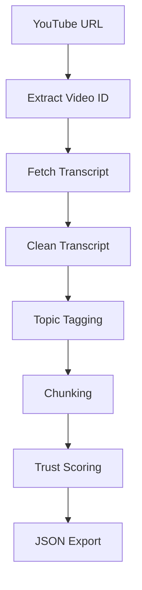
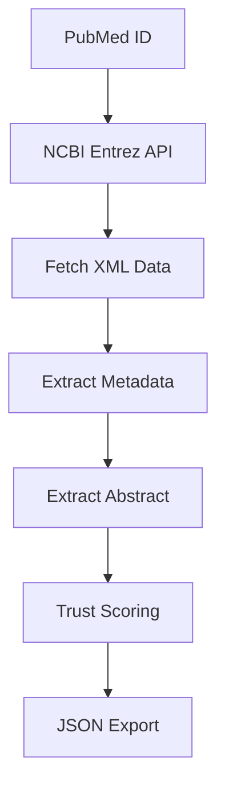
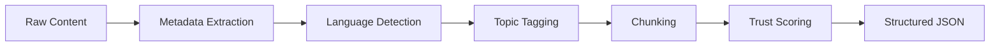
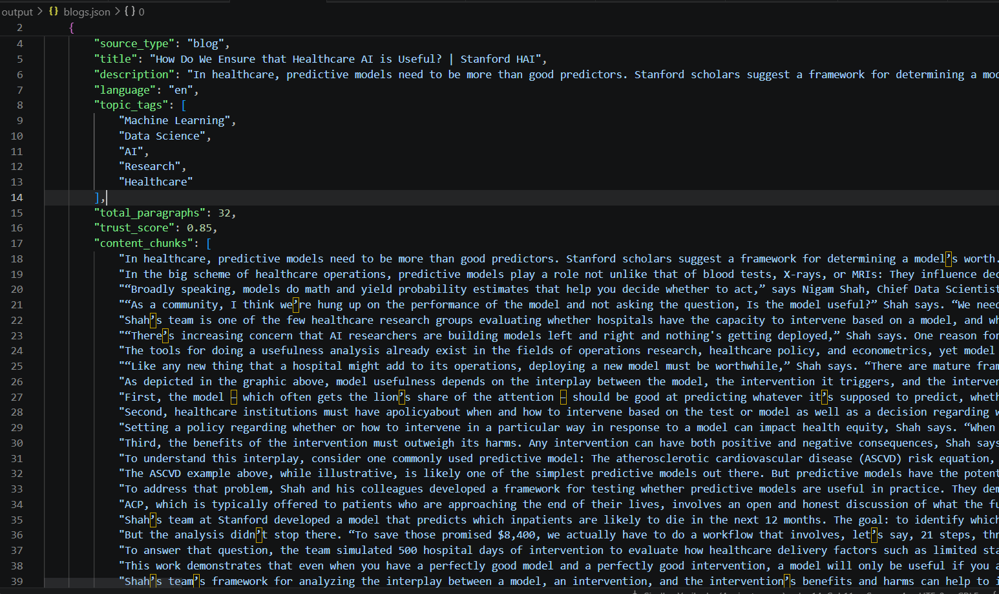
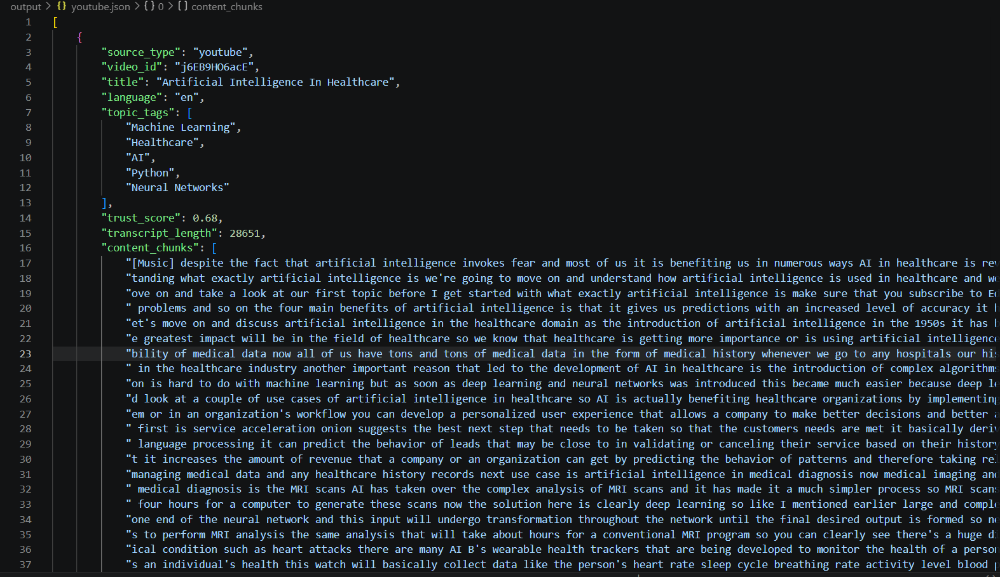
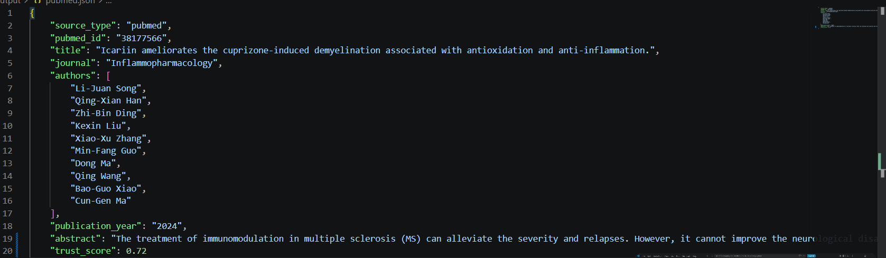

# AI Data Scraping and Multisource Trust Scoring System

<p align="center">
  <b>Multi-source AI-powered data ingestion and trust evaluation pipeline</b>
</p>

---

# Project Overview

This project is a modular AI data ingestion and trust scoring system that collects information from multiple online sources and converts it into structured AI-ready JSON data.

The system currently supports:

* Blogs
* YouTube videos
* PubMed research articles

The extracted data is:

* cleaned
* analyzed
* chunked
* tagged
* assigned a trust score
* exported as structured JSON

This project demonstrates:

* Web scraping
* AI preprocessing pipelines
* NLP concepts
* Metadata extraction
* Data normalization
* Trust evaluation systems
* Modular software architecture

---

# Problem Statement

Modern AI systems consume huge amounts of information from the internet.

However:

* not all sources are trustworthy
* medical misinformation is common
* blogs and videos often lack validation
* metadata can be incomplete

This project solves that by:

1. Collecting information from multiple source types
2. Extracting structured metadata
3. Evaluating reliability using a trust scoring system
4. Producing AI-ready normalized outputs

---

# Complete System Workflow



---

# Architecture Overview



---

# Features

# 1. Blog Scraper

The blog scraper extracts:

* page title
* article description
* article text
* metadata
* paragraphs
* language
* topic tags
* trust score

### Technologies Used

* requests
* BeautifulSoup4
* langdetect

### Example Sources

* Stanford HAI
* Infermedica
* Medium

---

# 2. YouTube Scraper

The YouTube scraper extracts:

* transcript
* video metadata
* chunked transcript text
* trust score

### Technologies Used

* youtube-transcript-api

### Process Flow



---

# 3. PubMed Scraper

The PubMed scraper extracts:

* article title
* abstract
* authors
* journal information
* publication year
* metadata
* trust score

### Technologies Used

* Biopython Entrez API

### Process Flow



---

# AI Processing Pipeline

# 1. Language Detection

The system uses:

```python
langdetect
```

to automatically identify the language of extracted content.

Example:

```text
English -> en
```

---

# 2. Topic Tagging

Keyword-based NLP tagging is used to automatically identify major topics.

### Example Topics

| Topic            | Keywords                      |
| ---------------- | ----------------------------- |
| AI               | ai, artificial intelligence   |
| Healthcare       | hospital, healthcare, patient |
| Machine Learning | model, predictive             |
| Data Science     | analytics, data               |
| Research         | study, paper                  |

---

# 3. Text Chunking

Large text blocks are divided into smaller chunks.

This is useful for:

* Retrieval-Augmented Generation (RAG)
* Vector databases
* LLM processing
* Embedding generation
* AI memory systems

### Chunking Example

```text
Chunk 1 -> Introduction
Chunk 2 -> Main concepts
Chunk 3 -> Technical details
```

---

# Trust Scoring System

Each source receives a trust score between:

```text
0.0 -> Low Trust
1.0 -> High Trust
```

---

# Trust Score Formula

```text
Trust Score =
0.30 × Author Credibility +
0.25 × Citation Score +
0.20 × Domain Authority +
0.15 × Recency +
0.10 × Disclaimer Presence
```

---

# Trust Factors Explained

| Factor              | Purpose                                 |
| ------------------- | --------------------------------------- |
| Author Credibility  | Trusted authors score higher            |
| Citation Score      | More references improve trust           |
| Domain Authority    | Trusted domains score higher            |
| Recency             | Newer content gets better score         |
| Disclaimer Presence | Medical disclaimers improve reliability |

---

# Domain Scoring Logic

### High Trust Domains

* .gov
* .edu
* Stanford
* NIH
* WHO

### Medium Trust Domains

* Medium
* Infermedica
* TowardsDataScience

---

# Project Structure

```text
AI-data-scraping-and-Multisource-trust-scoring-system/
│
├── scraper/
│   ├── blog_scraper.py
│   ├── youtube_scraper.py
│   └── pubmed_scraper.py
│
├── scoring/
│   └── trust_score.py
│
├── output/
│   ├── blogs.json
│   ├── youtube.json
│   └── pubmed.json
│
├── requirements.txt
├── README.md
└── main.py
```

---

# Technologies Used

| Technology             | Purpose                   |
| ---------------------- | ------------------------- |
| Python                 | Main programming language |
| BeautifulSoup4         | HTML parsing              |
| Requests               | HTTP requests             |
| Langdetect             | Language detection        |
| YouTube Transcript API | Transcript extraction     |
| Biopython              | PubMed integration        |
| JSON                   | Structured data storage   |

---

# Installation Guide

# Step 1 — Clone Repository

```bash
git clone https://github.com/Sindhu-Yesilanka/AI-data-scraping-and-Multisource-trust-scoring-system.git
```

---

# Step 2 — Create Virtual Environment

```bash
python -m venv venv
```

Activate:

### Windows

```bash
venv\Scripts\activate
```

### Linux / Mac

```bash
source venv/bin/activate
```

---

# Step 3 — Install Requirements

```bash
pip install -r requirements.txt
```

---

# Running the Project

# Blog Scraper

```bash
python -m scraper.blog_scraper
```

---

# YouTube Scraper

```bash
python -m scraper.youtube_scraper
```

---

# PubMed Scraper

```bash
python -m scraper.pubmed_scraper
```

---

# Example Output Structure

```json
{
  "source_url": "https://example.com",
  "source_type": "blog",
  "title": "Healthcare AI",
  "language": "en",
  "topic_tags": ["AI", "Healthcare"],
  "trust_score": 0.85,
  "content_chunks": []
}
```

---

# Example JSON Pipeline Output



---

# Future Improvements

The system can be expanded with:

* dynamic URL ingestion
* database storage
* vector database integration
* semantic search
* LLM-based trust evaluation
* web dashboard
* FastAPI backend
* automated crawling
* advanced NLP models
* real-time monitoring

---

# Learning Outcomes

This project demonstrates understanding of:

* Web scraping
* NLP preprocessing
* AI ingestion pipelines
* Trust evaluation systems
* JSON normalization
* API integration
* Modular Python architecture
* AI-ready data pipelines

---

# Screenshots Section


```


```


```

---

# Author

Sindhu Yesilanka

---

# License

MIT License
